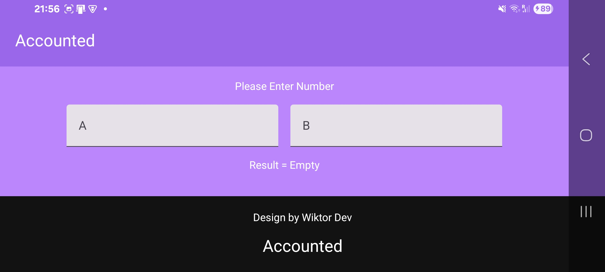

# Kotlin Practice One — Input Calculator (Adaptive UI)

  

  
  
  
  
  

A simple **calculator application with user input**, built using **Kotlin and Jetpack Compose** as part of the first practical task.  
This version includes **basic adaptive layout support for portrait and landscape orientations**.

---

## 📱 Description

This project is a learning-focused Android application that demonstrates:

- basic user input handling
- conditional calculations
- state handling using `remember`
- UI updates in Jetpack Compose
- adaptive layout behavior for screen orientation changes

---

## ✨ Features

- Two numeric input fields  
- Button-triggered calculation  
- Dynamic result rendering  
- Portrait and landscape layout adaptation  
- Keyboard-aware UI behavior  
- Material 3 design components  

---

## 🧮 Calculation Logic

The calculation follows these rules:

- If **x > 6**:

Where:
- `x` — first input value  
- `a`, `b` — second input value  

---

## 🖼 Screenshots

---

## 🌿 Branches

- `practic_one_calculator` — basic calculator implementation  
- `practic_two` — calculator with adaptive portrait / landscape layout  

---

## 🚀 How to Run

1. Clone the repository  
2. Open the project in **Android Studio**  
3. Run on an emulator or physical Android device  

---

## 📄 License

Educational project for learning purposes.
