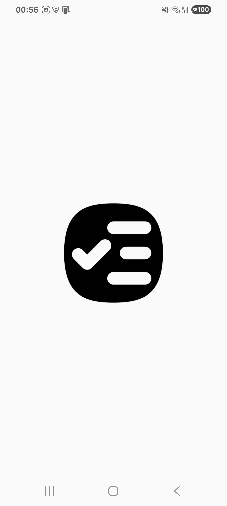
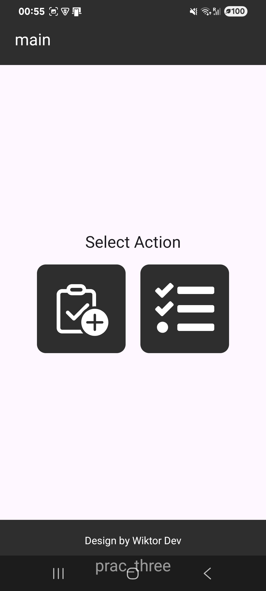
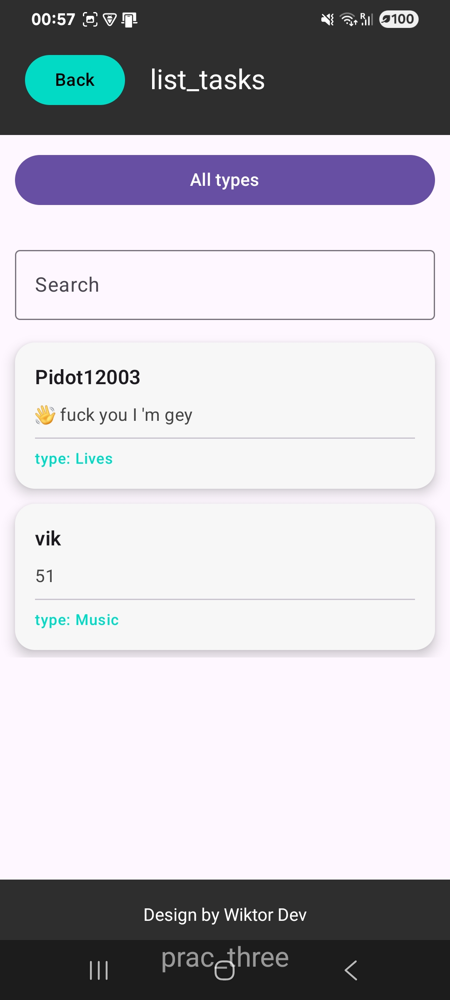
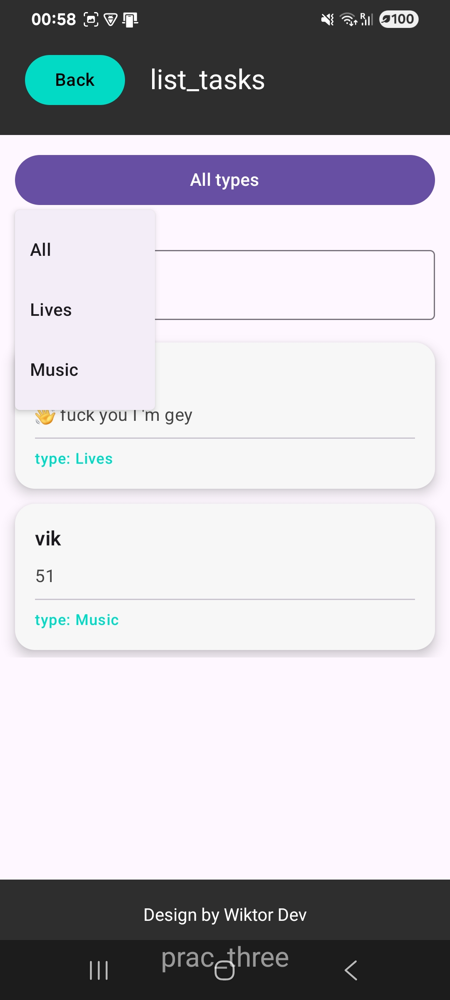
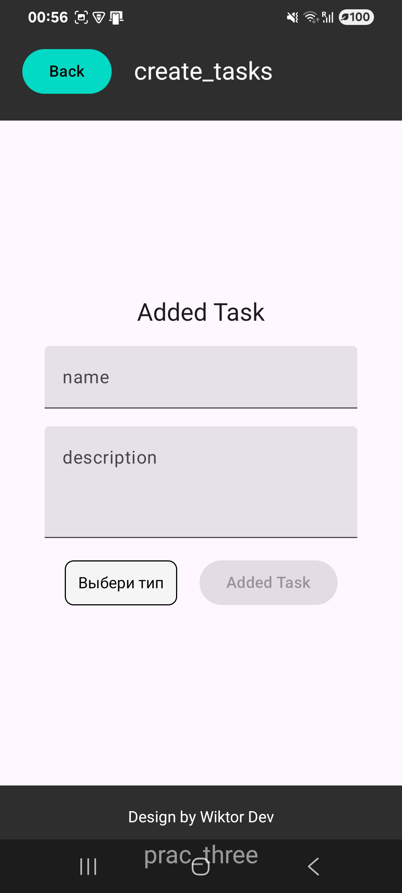
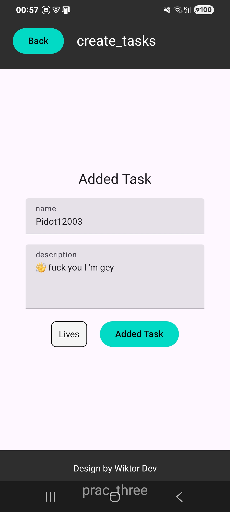

# Kotlin Practice Three — Task Manager (Multi-Screen App)

  

  
  
  
  

A **multi-screen Android application** built with **Kotlin and Jetpack Compose** as a practical task.  
The project demonstrates **navigation between multiple windows**, **data transfer between screens**, **task creation**, **filtering**, and **custom UI design created manually**.

---

## 📱 Project Description

This application is a **task manager** consisting of **three main screens**:

1. **Main screen** — action selection  
2. **Create task screen** — input and selection  
3. **Task list screen** — displaying and filtering created tasks  

All user-entered data is passed between screens and rendered dynamically on the final screen.

---

## ✅ Assignment Requirements Coverage

The project fully satisfies the task requirements:

- ✔ **Three separate windows (screens)**
- ✔ **Input fields** (task name, description)
- ✔ **Selection elements** (task type via dropdown / options)
- ✔ **Images and icons**
- ✔ **Different background styles per screen**
- ✔ **Navigation buttons**:
  - Forward
  - Back
  - Exit
- ✔ **Final screen displays data from previous screens**

---

## ✨ Additional Features (Extended)

Beyond the base requirements, the project includes:

- ➕ **Task creation system**
- 🔍 **Filtering tasks by type**
  - via dropdown option selector
  - via text search input
- 🧭 **Manual navigation logic**
- 🧱 **Clean and readable project architecture**
- 🎨 **Custom UI design (no templates, no generators)**

---

## 🧱 Architecture

The project is structured with a **clean UI-focused architecture**:

- `ui` — screens and layouts
- `components` — reusable UI components
- `types` — task types and enums
- `navigation` — screen routing logic
- `state` — UI state handling

State is managed using **Compose state (`remember`, `mutableStateOf`)**  
Navigation is handled manually without heavy external frameworks.

---
## 🖼 Screenshots

### Main Screen

  
  

### Task List + Filtering

  
  

### Create Task (Empty / Filled)

  
  
  

---

## 🚀 How to Run

1. Clone the repository  
2. Open the project in **Android Studio**
3. Wait for Gradle sync to complete
4. Run on an emulator or physical Android device

---

## 🧠 Notes

- All UI and logic were implemented **manually**
- No UI builders or templates were used
- This project was **more complex than typical web applications**
- Focus was placed on understanding **state, navigation, and Compose layout behavior**

---

## 📄 License

Educational project created for learning and practice purposes.

