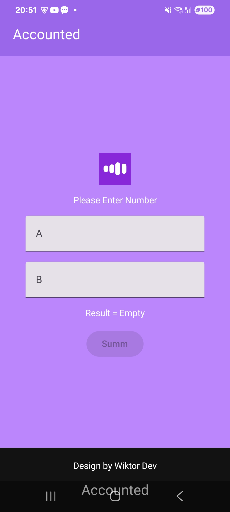

# Kotlin Practice — Calculator App

Simple calculator app built with **Kotlin + Jetpack Compose**.

## Screenshots

  
  
  

## Branches

- `practic_one_calculator` — Calculator with inputs and operations
